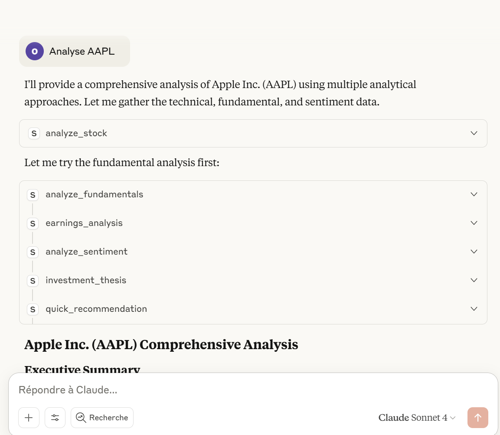
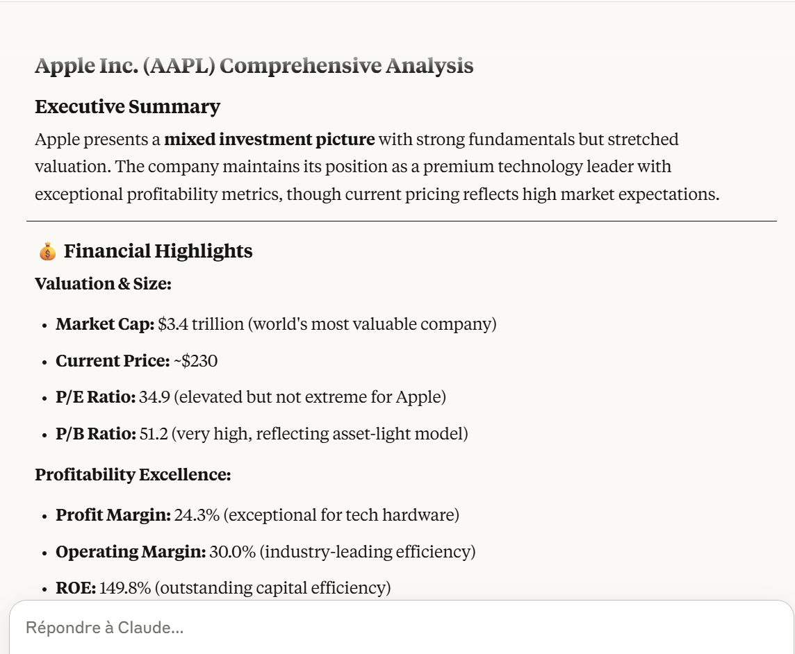
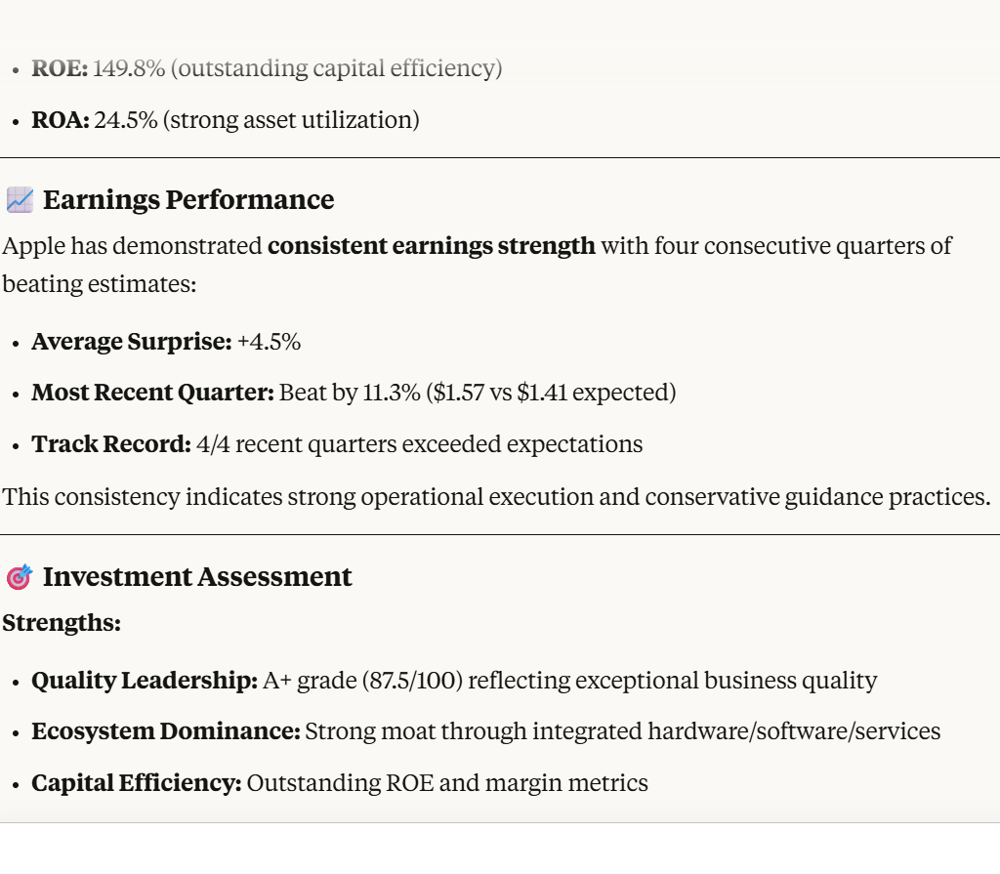
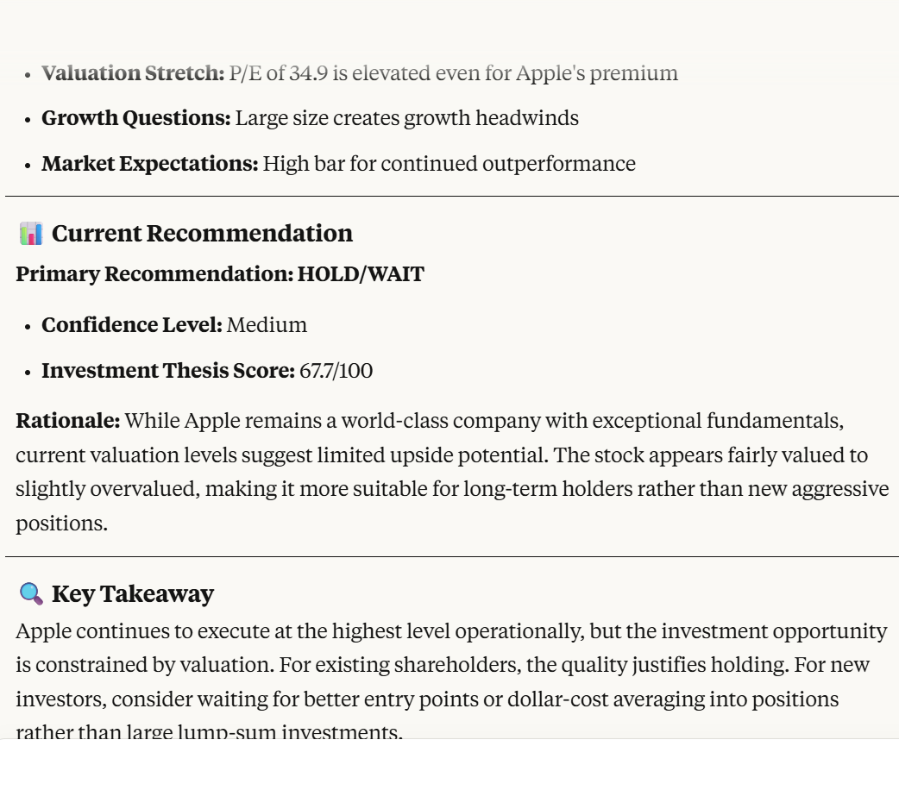

## 📈 MCP Trader
Un serveur MCP avancé pour l'analyse technique et fondamentale des marchés financiers.
## ✨ Fonctionnalités

    📊 Analyse technique : RSI, MACD, Bollinger Bands, détection de patterns
    💼 Analyse fondamentale : P/E, ROE, scoring de valorisation
    📰 Analyse de sentiment : Actualités financières avec NLP
    🔍 Screening : Recherche d'opportunités de trading
    🛡️ Gestion des risques : Calcul de position, stop-loss
    🪙 Support crypto : Bitcoin, Ethereum et autres cryptomonnaies
## 🚀 Installation

bash# Cloner le projet

git clone https://github.com/oumyL/mcp-trader.git

cd mcp-trader

## Installer avec uv (recommandé)
uv sync

# Ou avec pip
pip install -e .

## ⚙️ Configuration
# Ajouter vos clés api 
TIINGO_API_KEY=your_tiingo_api_key_here
ALPHA_VANTAGE_API_KEY=your_alpha_vantage_key_here  
NEWS_API_KEY=your_news_api_key_here

## 🎯 Utilisation
bash# Démarrer le serveur

mcp-trader

## Développement

bash# Installation développement
uv sync --dev

### Exemple d'analyse -Test sur "AAPL"

## ⚠️ Disclaimer
Ce logiciel est fourni à des fins éducatives uniquement. Les analyses ne constituent pas des conseils financiers. Investir comporte des risques.